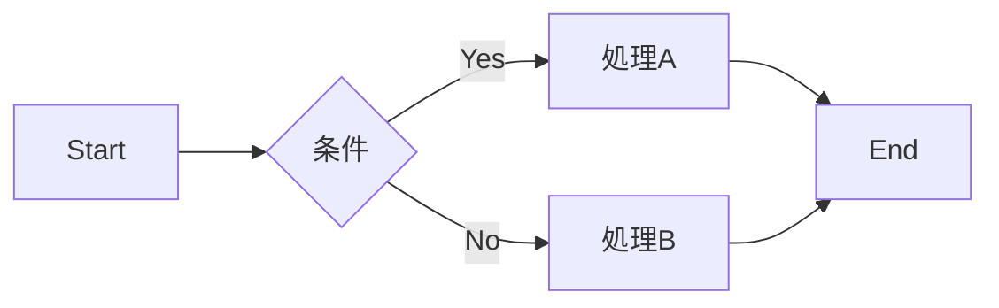
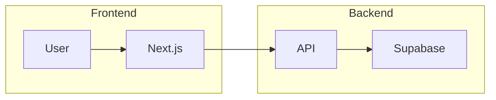

Git test[[無題のファイル 1.base]]

```mermaid
flowchart LR
    A[Start] --> B{条件}
    B -->|Yes| C[処理A]
    B -->|No| D[処理B]
    C --> E[End]
    D --> E
```

```mermaid
flowchart LR
    A[Start] --> B{条件}
    B -->|Yes| C[処理A]
    B -->|No| D[処理B]
    C --> E[End]
    D --> E
```

```mermaid
flowchart LR
    問い合わせ --> 担当確認
    担当確認 --> 回答
    回答 --> 完了
```

```mermaid
flowchart LR

subgraph Frontend
    A[User]
    B[Next.js]
end

subgraph Backend
    C[API]
    D[Supabase]
end

A --> B
B --> C
C --> D
```
